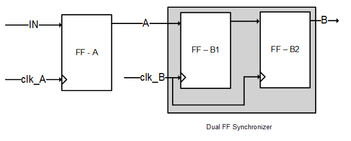

# Static Bus CDC

This CDC method is very simple, takes little to no utilization (especially in comparison to the other methods), but has limited use.

## Description

The simplest of CDCs, is to pass a single or multiple signals from one clock to another, as long as they are known to hold their values for long.
The only thing required is a register to stabilize the signal in clock A’s domain, and then stabilize it by sampling it twice in clock B’s domain.
This takes little to no utilization, and works well enough for most signals which remain the same for long periods of time.

**Notice!** The signals are expected to remain static for at least 2 clocks of the slower clock. In case the signals change after less than a clock, the output would be unsure, and may have glitches. Technically, the signals could change every 2 slow clocks, but the main purpose of this CDC method is to synchronize signals which remain consistent for long periods of time.

## Throughput and Latency

This method does not pass interfaces which consider throughput as a factor.
Latency is `CLK_A + 2 x CLK_B`.
This means, the latency relatively increases if clock B is the slower of the two.